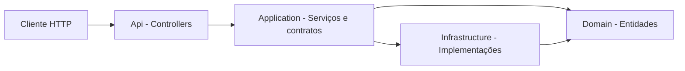

# API_GHOST — Guia da arquitetura (Clean Architecture)

Este documento resume **o papel de cada camada e pasta** e **onde implementar evoluções** futuras (novos recursos, banco de dados, autenticação, etc.).

---

## Visão geral

Um pedido HTTP entra na **Api**, chama um **serviço da Application**, que depende de **interfaces** (contratos). A **Infrastructure** fornece **implementações concretas** (neste projeto: dados **mockados** em memória). O **Domain** concentra **entidades** e conceitos centrais do negócio, sem depender de frameworks.



---

## Projetos da solução

| Projeto | Caminho | Função |
|---------|---------|--------|
| **Domain** | `src/Domain` | Entidades e modelo de negócio puro. |
| **Application** | `src/Application` | Casos de uso, DTOs, interfaces de repositório, serviços de aplicação. |
| **Infrastructure** | `src/Infrastructure` | Implementações técnicas (mock, futuro: EF Core, APIs externas). |
| **Api** | `src/Api` | ASP.NET Core: controllers, `Program.cs`, configuração HTTP/Swagger. |

**Dependências:** `Api` → `Application` + `Infrastructure` · `Infrastructure` → `Application` · `Application` → `Domain`.

---

## Domain — núcleo do sistema

**Responsabilidade:** definir **o que existe no domínio** (entidades, value objects, enums de negócio) sem referenciar ASP.NET, banco, HTTP ou repositórios.

| Arquivo | Descrição |
|---------|-----------|
| `Entities/Product.cs` | Exemplo de entidade: identificador, nome, SKU, preço, estoque, data de criação. |

**Ao evoluir:** adicione novas entidades ou ajuste modelos aqui. Mantenha esta camada **livre** de infraestrutura e de detalhes de API.

---

## Application — casos de uso e orquestração

**Responsabilidade:** descrever **o que o sistema faz** (listar, buscar, criar produtos) usando **interfaces** para dados; não sabe se a fonte é mock, SQL ou serviço externo.

| Pasta / arquivo | Descrição |
|-------------------|-----------|
| `Abstractions/IProductRepository.cs` | Contrato de persistência: listar, buscar por id, adicionar. |
| `Products/IProductService.cs` | Contrato do caso de uso exposto à Api. |
| `Products/ProductService.cs` | Orquestra chamadas ao repositório e mapeamento para DTOs. |
| `Products/ProductDto.cs` | Dados de saída para a API. |
| `Products/CreateProductRequest.cs` | Dados de entrada para criação. |
| `Products/ProductMapping.cs` | Conversão entre entidade de domínio e DTO (interno à Application). |
| `DependencyInjection.cs` | Registro de `IProductService` → `ProductService`. |

**Ao evoluir:** novos fluxos = novos serviços/DTOs/contratos em `Abstractions`. Validações de regra de aplicação costumam ficar nos serviços (ou em validadores dedicados, se você adicionar depois).

---

## Infrastructure — detalhes técnicos

**Responsabilidade:** **implementar** os contratos definidos na Application com tecnologia concreta.

| Arquivo | Descrição |
|---------|-----------|
| `Persistence/MockProductRepository.cs` | Implementação de `IProductRepository` com lista em memória e dados iniciais mockados. |
| `DependencyInjection.cs` | Registro de `IProductRepository` → `MockProductRepository`. |

**Ao evoluir:** crie, por exemplo, `EfProductRepository` ou repositório SQL e **substitua ou complemente** o registro no `DependencyInjection` da Infrastructure. O restante da solução continua alinhado aos **mesmos contratos** da Application.

---

## Api — entrada HTTP

**Responsabilidade:** expor **endpoints**, receber/devolver JSON e status HTTP; delegar regras de negócio aos serviços da Application.

| Arquivo | Descrição |
|---------|-----------|
| `Controllers/ProductsController.cs` | `GET /api/products`, `GET /api/products/{id}`, `POST /api/products`. |
| `Program.cs` | Pipeline da aplicação, Swagger, HTTPS; `AddApplication()` e `AddInfrastructure()`. |
| `appsettings.json` / `appsettings.Development.json` | Configuração (logging, futuras connection strings). |
| `Properties/launchSettings.json` | URLs e perfil de execução (ex.: Swagger em desenvolvimento). |

**Ao evoluir:** novos controllers; autenticação/autorização; filtros globais; versionamento de API — em geral nesta camada ou via extensões registradas no `Program.cs`.

---

## Fluxo de uma requisição (exemplo)

1. O **controller** recebe o HTTP e chama **`IProductService`**.
2. **`ProductService`** usa **`IProductRepository`** e converte **`Product`** (Domain) em **`ProductDto`** (Application).
3. **`MockProductRepository`** satisfaz **`IProductRepository`**.

Substituir o mock por banco real implica principalmente **nova implementação na Infrastructure** e **ajuste do registro no DI**, mantendo estáveis Domain e contratos da Application.

---

## Checklist para uma feature nova

1. **Domain** — precisa de nova entidade ou alteração no modelo?
2. **Application** — novos contratos, DTOs e serviço (caso de uso)?
3. **Infrastructure** — implementação concreta (persistência, integrações)?
4. **Api** — novos endpoints ou controllers?

---

## Como executar (local)

Com o **SDK .NET** compatível com `net10.0` instalado:

```bash
dotnet restore API_GHOST.sln
dotnet build API_GHOST.sln
dotnet run --project src/Api/Api.csproj
```

Em desenvolvimento, o Swagger costuma estar disponível conforme `launchSettings.json` (ex.: `http://localhost:5000/swagger`).

Se o SDK 10 não estiver instalado, ajuste `<TargetFramework>` nos `.csproj` para a versão disponível na sua máquina (por exemplo `net9.0` ou `net8.0`) e alinhe pacotes NuGet se necessário.
