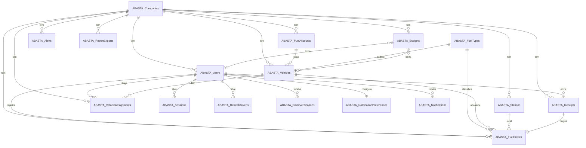

# Abasta.Api — backend do app Abasta

API REST (ASP.NET Core `net10.0`) para o app **Abasta** — controle de gastos com
combustível para empresas e frotas. Segue o **mesmo padrão** das demais APIs da
solução (FOLHA/GHOST): Clean Architecture em 4 camadas + **SQL Server** acessado
com **Dapper** e **migrations SQL** versionadas.

```
src/ABASTA/
  Abasta.Domain/          # entidades puras (17)
  Abasta.Application/     # casos de uso, DTOs, contratos (interfaces de repositório)
  Abasta.Infrastructure/  # Dapper + SqlSession + MigrationRunner + Migrations/Sql/*.sql
  Abasta.Api/             # controllers, Program.cs, Swagger
```

Dependências: `Api → Application + Infrastructure` · `Infrastructure → Application` · `Application → Domain`.

---

## Banco de dados

- **Engine:** SQL Server. Schema `dbo`.
- **Prefixo:** todas as tabelas são `ABASTA_<Entidade>` (PascalCase), colunas em `snake_case`.
- **Migrations:** scripts SQL idempotentes em `Abasta.Infrastructure/Migrations/Sql/`
  (embedded resources), aplicados na inicialização pelo `MigrationRunner` e
  controlados pela tabela `ABASTA_HistoryMigration` (cada script roda uma vez).

| # | Migration | Conteúdo |
|---|-----------|----------|
| 001 | `001_InitialSchema.sql` | Cria as tabelas de negócio, FKs, índices e constraints. |
| 002 | `002_SeedReferenceData.sql` | Semeia os tipos de combustível (Gasolina, Etanol, Diesel S-10, GNV). |
| 003 | `003_AddAccessTables.sql` | Convites (`ABASTA_Invitations`) e auditoria de acesso (`ABASTA_AccessLogs`). |

### As 19 tabelas

| Tabela | Papel |
|--------|-------|
| `ABASTA_Companies` | Empresa (tenant raiz). Tudo é escopado por `company_id`. |
| `ABASTA_FuelAccounts` | Contas da empresa em distribuidoras ("conta na BR Distribuidora"). |
| `ABASTA_Users` | Colaboradores (motoristas) e gestores. |
| `ABASTA_Sessions` | Sessões de login (token hash). |
| `ABASTA_RefreshTokens` | Refresh tokens rotacionáveis. |
| `ABASTA_EmailVerifications` | OTP de cadastro/recuperação. |
| `ABASTA_NotificationPreferences` | Toggles de notificação (1:1 com usuário). |
| `ABASTA_Vehicles` | Frota. |
| `ABASTA_VehicleAssignments` | Histórico veículo↔motorista. |
| `ABASTA_FuelTypes` | Lookup de combustíveis (seed). |
| `ABASTA_Stations` | Postos. |
| `ABASTA_Receipts` | Foto do cupom + dados do OCR. |
| `ABASTA_FuelEntries` | **Nota de abastecimento** (tabela quente). |
| `ABASTA_Budgets` | Orçamento mensal (empresa / colaborador / veículo). |
| `ABASTA_Alerts` | Alertas do painel do gestor. |
| `ABASTA_Notifications` | Notificações in-app/push por usuário. |
| `ABASTA_ReportExports` | Geração assíncrona de relatórios (PDF/CSV). |
| `ABASTA_Invitations` | Convites de acesso à empresa (onboarding de colaboradores). |
| `ABASTA_AccessLogs` | Auditoria de acesso (login/logout/refresh). |

### Relacionamentos



> `Budgets` é polimórfico por FKs opcionais: ambos nulos = orçamento da **empresa**;
> `user_id` = do **colaborador**; `vehicle_id` = do **veículo** (CHECK garante no máximo um alvo).
> `Alerts` e `ReportExports` referenciam `target_user_id` / `target_vehicle_id` opcionais da mesma forma.

### Pensado para escalar a muitos dados

- **`ABASTA_FuelEntries`** (a tabela que mais cresce) tem **soft delete** (`deleted_at`)
  e **índices compostos filtrados** alinhados aos acessos do app:
  `(company_id, fueled_at DESC)`, `(user_id, fueled_at DESC)`, `(vehicle_id, fueled_at DESC)`,
  além de índices em `station_id` e `fuel_type_id` — todos `WHERE deleted_at IS NULL`.
- **PKs `UNIQUEIDENTIFIER` com `NEWSEQUENTIALID()`** evitam fragmentação de índice em alto volume
  (inserts sequenciais), mantendo IDs globais (bons p/ sync offline-first do app).
- **`ON DELETE CASCADE` só** nas tabelas dependentes de `ABASTA_Users` (sessões, tokens,
  notificações) — caminho único. Tabelas de negócio usam `NO ACTION` + soft delete,
  evitando múltiplos caminhos de cascade e exclusões em massa acidentais.
- Índices únicos **filtrados** garantem regras sem bloquear escala
  (1 cupom → 1 abastecimento; 1 orçamento por escopo/mês; 1 motorista primário ativo por veículo).

---

## Autenticação e acessos

Login com **JWT Bearer**. O token carrega as claims `sub` (usuário), `company_id`
(empresa/tenant) e `role` (`collaborator`/`admin`); os controllers leem o escopo
dessas claims (sem header manual). Senhas com **BCrypt**, refresh tokens
rotacionáveis (hash em banco) e verificação de e-mail por código (OTP).

| Método | Rota | Acesso | Descrição |
|--------|------|--------|-----------|
| POST | `/api/auth/signup` | anônimo | Cria empresa + gestor. Devolve tokens (ou pede verificação de e-mail). |
| POST | `/api/auth/login` | anônimo | Login; devolve access+refresh, empresa e papel. |
| POST | `/api/auth/verify-email` | anônimo | Confirma o código de 6 dígitos e já loga. |
| POST | `/api/auth/resend-code` | anônimo | Reenvia o código de verificação. |
| POST | `/api/auth/refresh` | anônimo | Renova o par de tokens. |
| POST | `/api/auth/logout` · `/logout-all` | anônimo / token | Revoga refresh token(s). |
| GET/PUT | `/api/users/me` | token | Perfil do usuário logado. |
| GET | `/api/users` · `/api/users/{id}` | token | Equipe da empresa. |
| POST | `/api/users` | gestor | Cria colaborador na empresa. |
| DELETE | `/api/users/{id}` | gestor | Desativa colaborador. |
| POST/GET | `/api/invitations` | gestor | Cria/lista convites de acesso. |
| POST | `/api/invitations/accept` | anônimo | Aceita convite (cria a conta com senha). |
| GET | `/api/access-logs` | gestor | Auditoria de acessos da empresa. |

## Endpoints de domínio implementados

| Método | Rota | Descrição |
|--------|------|-----------|
| GET | `/api/health` | Sanidade. |
| GET | `/api/fuel-types` | Catálogo de combustíveis. |
| GET/POST/PUT | `/api/vehicles` | CRUD de veículos. |
| GET/POST/PUT/DELETE | `/api/fuel-entries` | Notas de abastecimento (filtro por `userId`/`vehicleId`; delete = soft delete). |

As demais entidades (Stations, Receipts, Budgets, Alerts, Notifications,
ReportExports) **já têm tabela e entidade de domínio**; basta seguir o mesmo
padrão (Abstraction → Repository Dapper → Service → Controller) para expô-las.

---

## Como rodar

1. Crie um banco **AbastaDB** no SQL Server e ajuste
   `ConnectionStrings:AbastaConnection` em `Abasta.Api/appsettings.json`.
2. `Database:RunMigrations: true` aplica o schema automaticamente no startup.

```bash
dotnet build src/ABASTA/Abasta.Api/Abasta.Api.csproj
dotnet run   --project src/ABASTA/Abasta.Api/Abasta.Api.csproj
# Swagger em http://localhost:5003/swagger
```

## Próximos passos (seguindo o padrão da solução)

1. Slices restantes (Stations, Receipts+OCR, Budgets, Alerts, Notifications, ReportExports).
2. Endpoints de agregação para o app (dashboard do colaborador, visão da equipe, relatórios).
3. Recuperação de senha por OTP (reaproveitando `ABASTA_EmailVerifications` com `purpose='reset'`).
